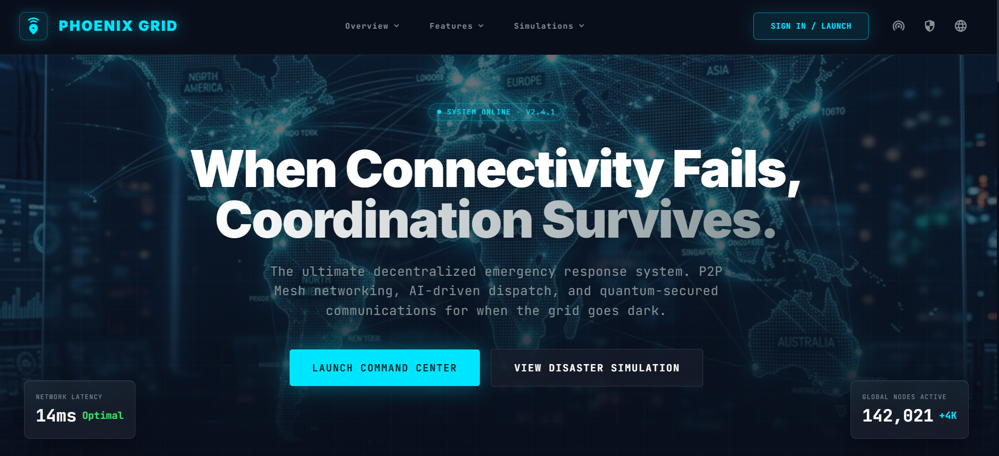
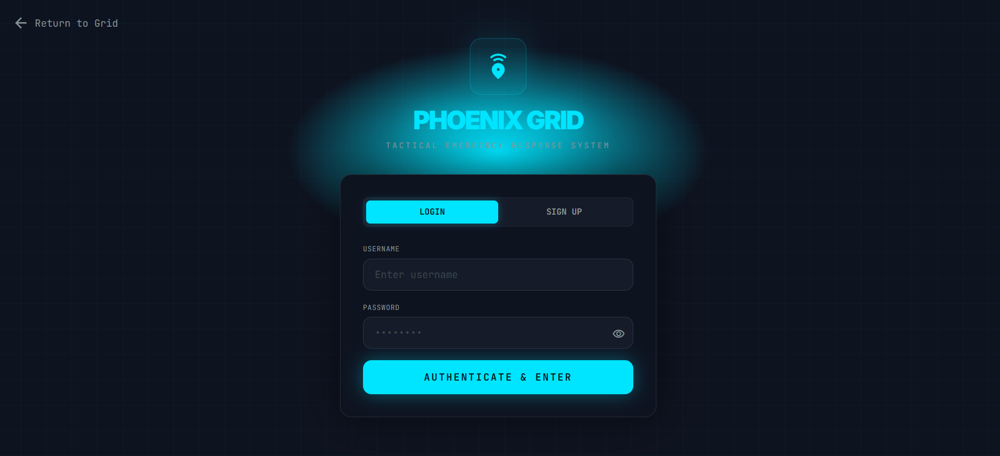
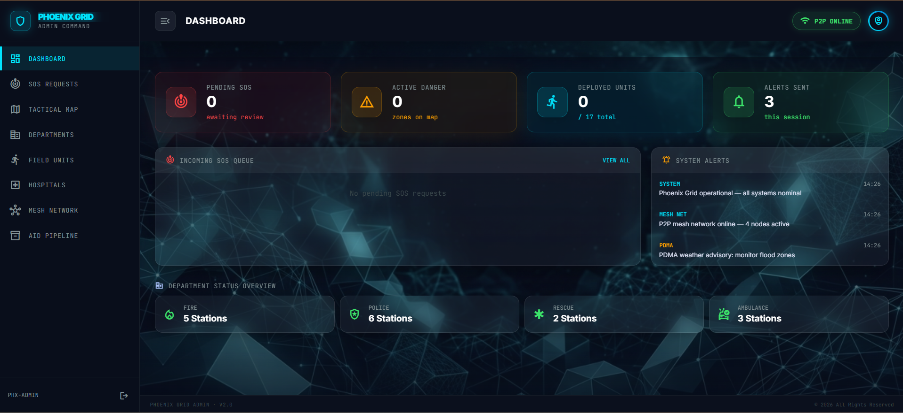
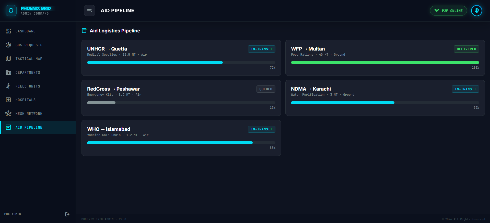
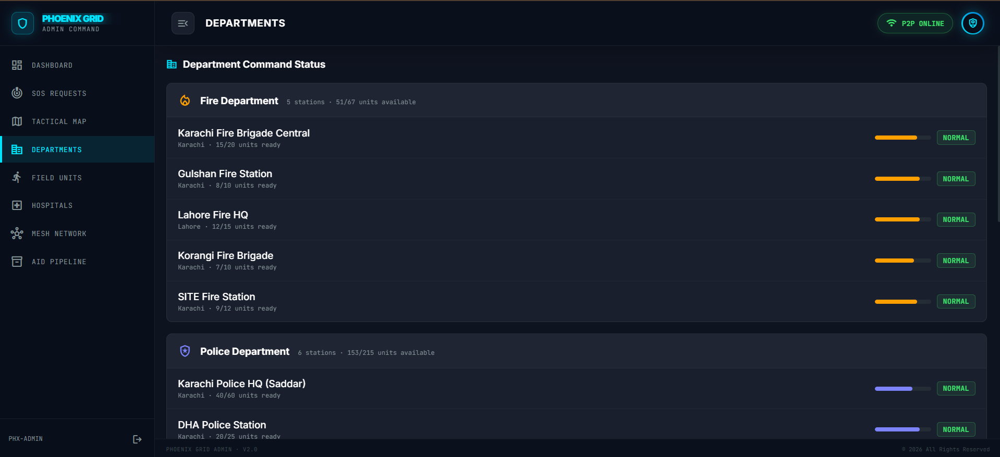
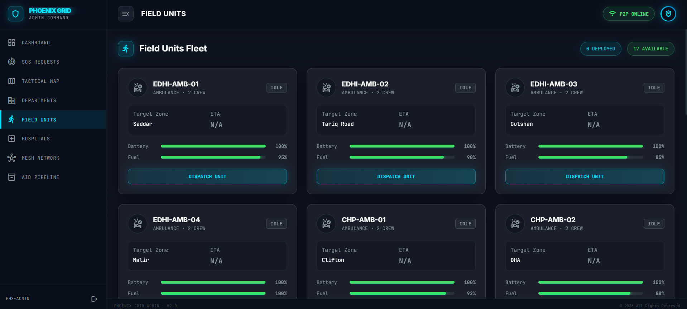
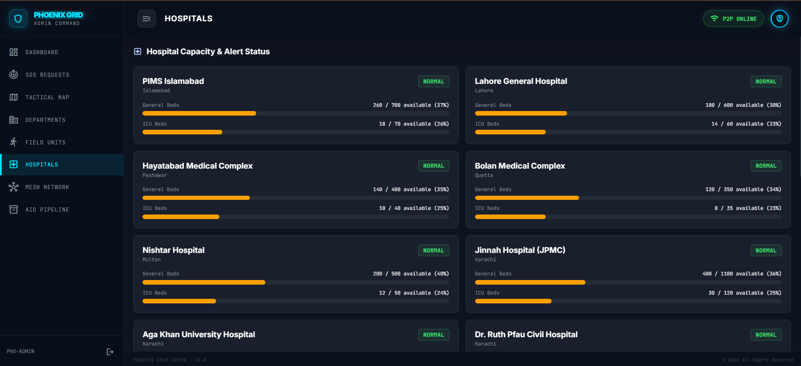
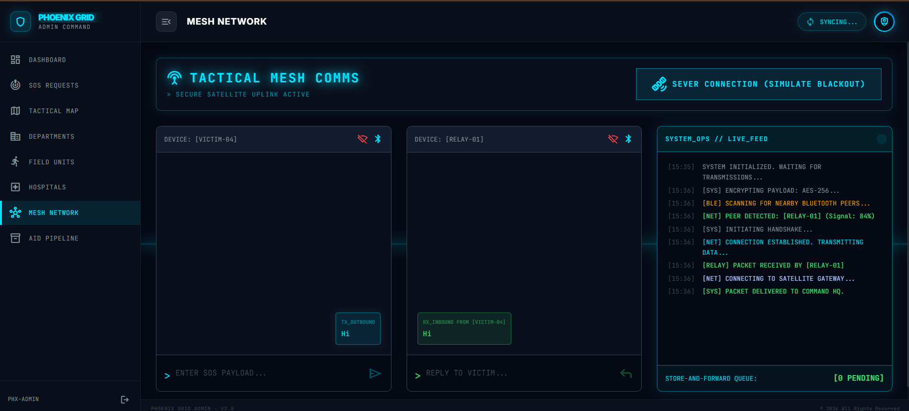
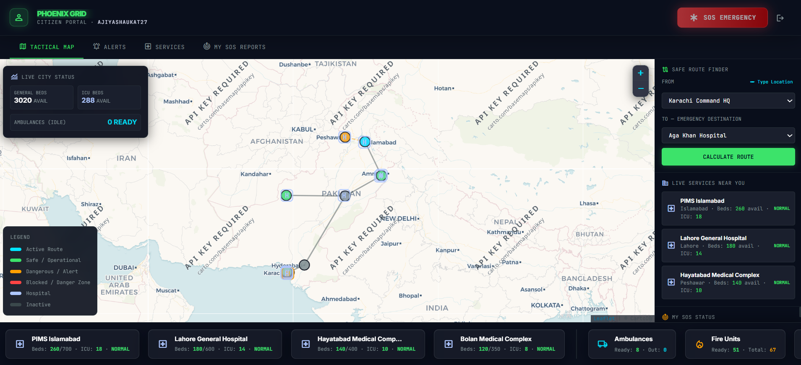

# Phoenix Grid

Phoenix Grid is a disaster response, coordination, and infrastructure monitoring dashboard designed for emergency operations. It combines a real-time tactical map, dispatch workflows, AI causality insights, citizen reporting, and command-center visualization into a single interface.

## Features

- Live emergency dashboard and operations overview
- Rescue and dispatch coordination
- Infrastructure and resource monitoring
- AI-driven causality analysis
- Citizen and command center interfaces
- Multi-region scenario simulation
- SQL-backed persistence for operational records

## Tech Stack

- Frontend: React + Vite + TypeScript
- Styling: Tailwind CSS
- Backend: Node.js + Express
- Database: Microsoft SQL Server (local SQL Express / Windows authentication)
- Map layer: Leaflet

## Project Structure

```text
PhoenixGrid/
├── public/                          # Static assets and screen mockups
├── server/                          # Express API and DB connection
├── src/                            # React app source
├── java_architecture/               # Java architecture artifacts
├── stitch_phoenix_grid_command_system/  # Command system HTML modules
├── .gitignore
├── index.html
├── package.json
├── package-lock.json
├── postcss.config.js
├── setup_database.sql
├── tailwind.config.js
├── tsconfig.json
├── vite.config.ts
├── README.md
└── test-db.js
```

## Prerequisites

Before running the project, ensure you have:

- Node.js 18+ installed
- npm installed
- Microsoft SQL Server / SQL Server Express running locally
- Windows authentication enabled for the `PhoenixGrid` database

## Setup

1. Install dependencies:

```bash
npm install
```

2. Create or restore the database:

```bash
sqlcmd -S "localhost\SQLEXPRESS" -E -C -d master -i setup_database.sql
```

3. Start the app:

```bash
npm run dev
```

The app runs with:

- Frontend: http://localhost:3000
- Backend: http://localhost:8081

## Database

The project expects a SQL Server database named `PhoenixGrid`.

The database setup script is located at:

```text
setup_database.sql
```

It creates the required tables and seed data for operations such as:

- `SosRequests`
- `DispatchRecords`
- `Nodes`
- `Edges`
- `Entities`
- `EventsLog`
- `Snapshots`

## API Health Check

You can verify the backend is running with:

```bash
curl http://localhost:8081/api/health
```

## Screenshots

### Home / Landing Page



### Login



### Dashboard



### Aid Pipeline



### Departments



### Field Units



### Hospitals



### Mesh Network



### Citizen Portal



## Deployment Notes

This project is structured for frontend deployment on Vercel and backend deployment on a Node-compatible host.

### Vercel PR / Preview Deployments

The frontend can be deployed on Vercel for preview or pull request builds. However, this application currently depends on a local desktop SQL Server instance (`localhost\SQLEXPRESS`) and Windows authentication, which will not work in Vercel or other remote preview environments.

For PR previews, production deploys, or any hosted environment:

- move the database to a hosted SQL Server service such as Azure SQL or another remote SQL Server instance,
- update the backend connection settings to use environment variables instead of local machine-specific values,
- expose the backend API URL to the frontend through `VITE_API_URL`,
- ensure the database schema is created and seeded on the hosted database before usage.

In short: Vercel is fine for frontend PR previews, but the database must be hosted separately; the local desktop database cannot be used directly in remote deployments.

## License

This project is for demonstration and emergency response simulation purposes.

## Author

Copyright © 2026 THPA Scheduling Simulator. All rights reserved.
Developed by Ajiya Shaukat.
